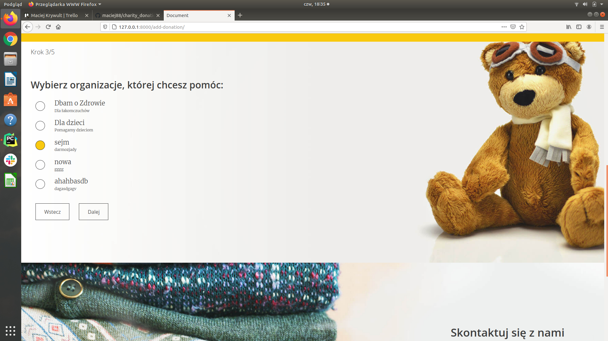
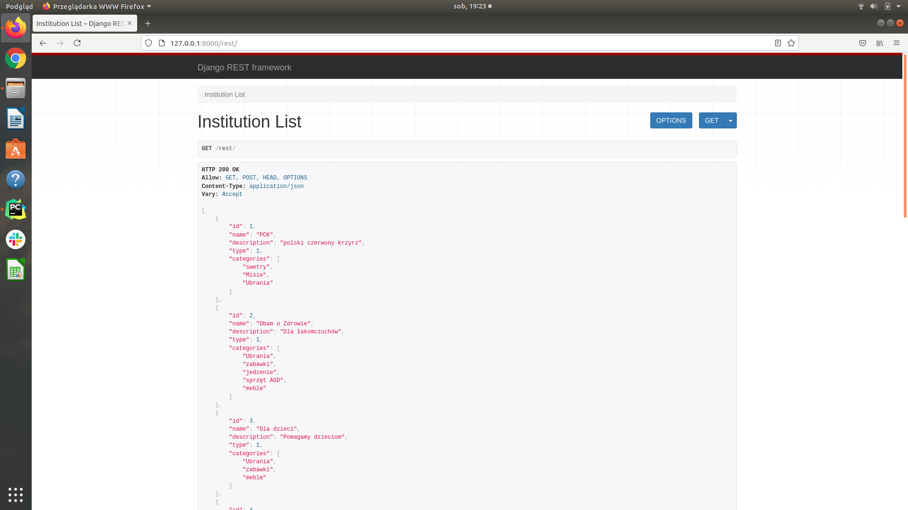

# charity_donation
Demonstracja umiejętności back-end.

Otrzymałem layout strony, który musiałem dostosować do odpowiednich potrzeb w back-end:
- odpowiednie skonfigurowanie projektu pod Python/ Django, Javascript (korzystanie ze źródeł 'static'),
- przygotowanie bazy danych - wykorzystanie PostgreSQL, SQL i napisanie modeli w python/django,
- wprowadzenie obsługi odnośników, przekierowań oraz dynamiki podliczania statystyk,
- administrator posiada swój panel do zarządzania stroną oraz jej elementami (użytkownicy i instytucje),
- napisanie systemu logowania (email jako login - skożystałem z: https://www.fomfus.com/articles/how-to-use-email-as-username-for-django-authentication-removing-the-username),
- zabezpieczenie stron aby, użytkownk niezalogowany nie mógł namieszać :)
- projekt wykonywany był w sprincie z wykorzytaniem tablicy trello.

W przyszłości planuje dodać kilka innych ważnych funkcji:
- edytowanie profilu użytkownika oraz weryfikacja nowego użytkownika poprzez wysyłanie potwierdzenia e-mail (aktywacja z tokenu),
- paginacja instytucji na stronie głownej,
- wprowadzenie możliwości archiwizacji przekazanych darów.

zachęcam do zapoznania się ze stroną, jestem otwarty na uwagi :)

Przykładowe screeny z projektu:
Strona startowa:

Wykorzystanie JavaScript:

Sprint:

Rest:

